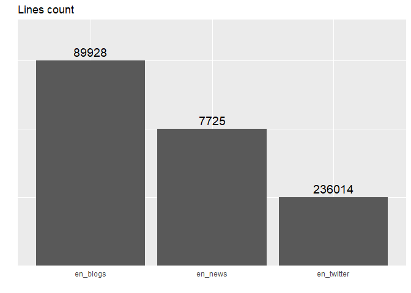
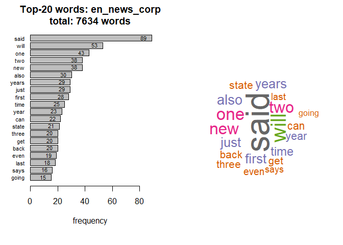
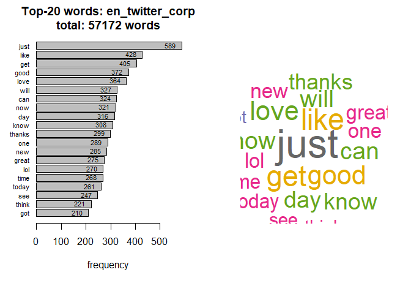
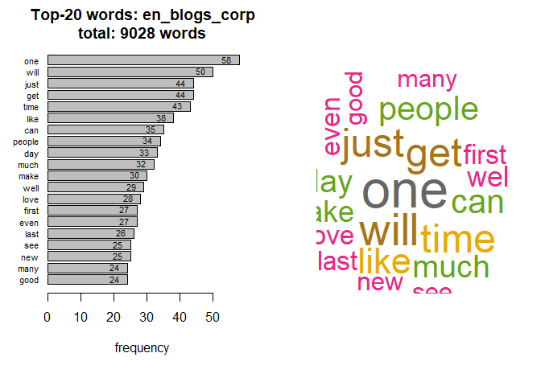
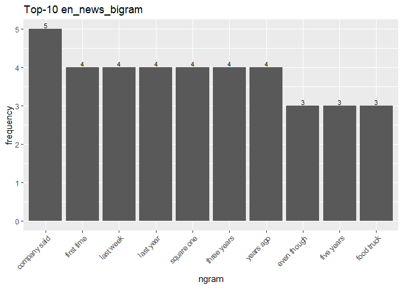
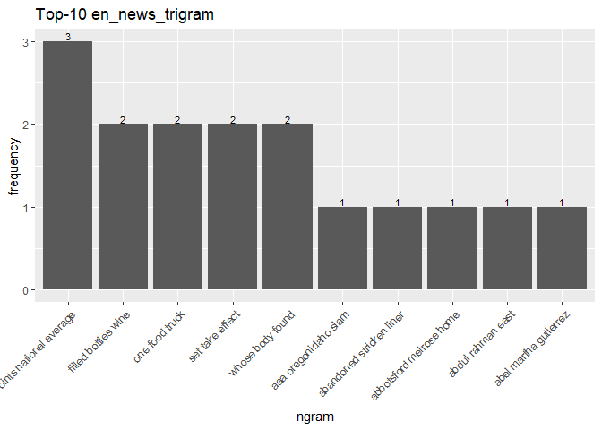
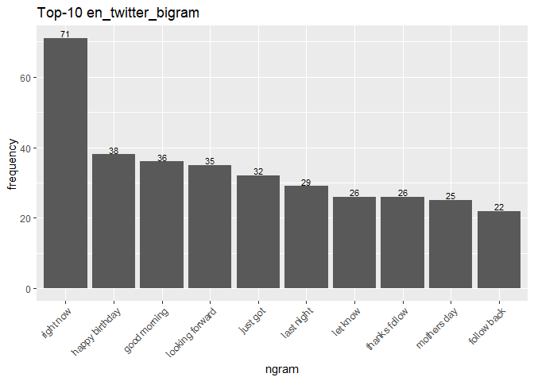
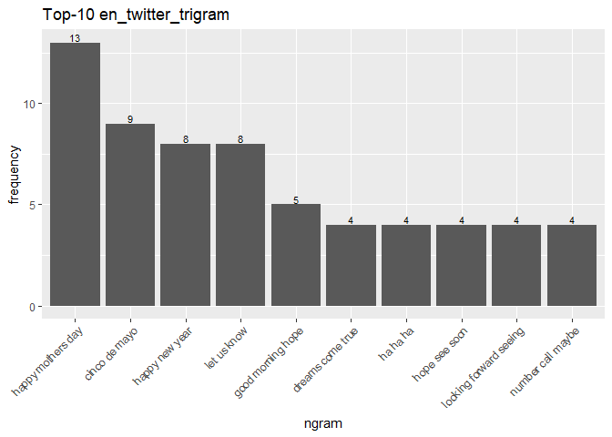
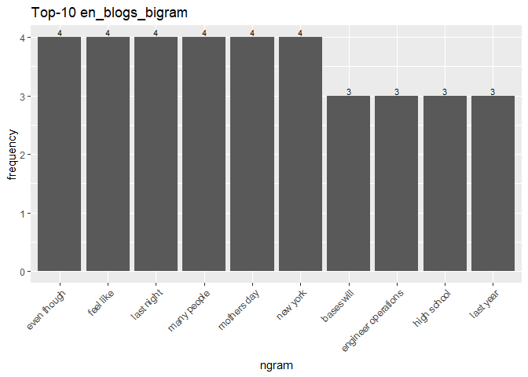
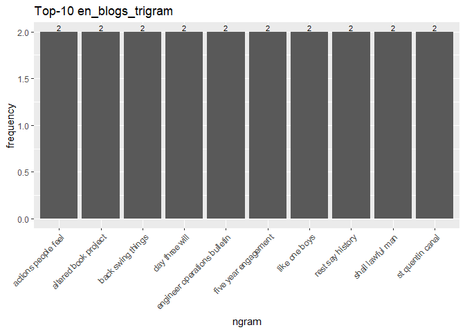

D.V. 06/07/20

# Introduction

This report will demonstrate the working with unstructured data for SwiftKey Capstone Project.
The first step is an exploratory analysis - understanding the distribution of words and relationship between the words in the corpora.
The second step is to understand frequencies of words and word pairs by building figures and tables.
The raw data (en_US.blogs.txt, en_US.news.txt, en_US.tweets.txt) were extracted from [link](http://d396qusza40orc.cloudfront.net/dsscapstone/dataset/Coursera-SwiftKey.zip).
Some profane words list (bad-words.txt) was downloaded from [link](http://www.freewebheaders.com/download/files/full-list-of-bad-words_text-file_2018_07_30.zip).


# Questions to consider

- Some words are more frequent than others - what are the distributions of word frequencies?
- What are the frequencies of 2-grams and 3-grams in the dataset?
- How many unique words do you need in a frequency sorted dictionary to cover 50% of all word instances in the language? 90%?
- How do you evaluate how many of the words come from foreign languages?
- Can you think of a way to increase the coverage - identifying words that may not be in the corpora or using a smaller number of words in the dictionary to cover the same number of phrases?


# Loading data


```r
#sample 10% data for each file 
set.seed(1313)
en_blogs <- readLines("en_US.blogs.txt", warn = FALSE, skipNul = TRUE, encoding = "UTF-8")
en_blogs <- sample(en_blogs, NROW(en_blogs) * 0.1, replace = FALSE)
```


```r
en_twitter <- readLines("en_US.twitter.txt", warn = FALSE, skipNul = TRUE, encoding = "UTF-8")
en_twitter <- sample(en_twitter, NROW(en_twitter) * 0.1, replace = FALSE)
```


```r
en_news <- readLines("en_US.news.txt", warn = FALSE, skipNul = TRUE, encoding = "UTF-8")
en_news <- sample(en_news, NROW(en_news) * 0.1, replace = FALSE)
```


```r
head(en_news, n=3)
```

```
## [1] "He sees the potential for independent movies, music, theatrical performances, maybe live comedy. He sees Voodoo Doughnut and Hotlips Pizza at the concession stands. He sees kids up on the stage, performing in a school pageant."
## [2] "Frank Farley is a psychologist and professor at Temple University. He is former president of the American Psychological Association. He wrote this for the Los Angeles Times (McClatchy-Tribune)."                                 
## [3] "The state hand-delivered its application Tuesday."
```

```r
head(en_twitter, n=3)
```

```
## [1] "What does that even mean? Let Oil companies run roughshod all over Florida so you can file briefs for them?"                    
## [2] "I can't sleep and I have school tomorrow! Ugh!!! Help me!"                                                                      
## [3] "Peculiar timing in the Seth Greenberg firing at Virginia Tech. Why wait until more than a month has passed since end of season?"
```

```r
head(en_blogs, n=3)
```

```
## [1] "I feel: like I am still suffering the effects of the flu I contracted last week"                                                                                                                                                                                     
## [2] "Increase the heat a touch and stir the mushrooms, sherry, mushroom bouillon, thyme and pepper flakes into the bacon and onion mixture. When the the mushrooms are cooked and more than half of the liquid has reduced in volume (about 8 minutes), stir in the peas."
## [3] "Thanks for my new followers and my old friends. Love all the comments I get!!!!"
```


```r
countgraph(en_news, en_twitter, en_blogs)
```

<!-- -->

# Cleaning data
Change to lower case, remove numbers, punctuations, white space, badwords and so one..


```r
#remove words with non-ASCII characters and make corpus
en_blogs_corp <- stri_trans_general(en_blogs, "latin-ascii")
words <- unlist(strsplit(en_blogs_corp, split=", ")) # convert string to vector of words
nonASCII <- grep("words", iconv(words, "latin1", "ASCII", sub="words")) #find indices non-ASCII characters
en_blogs_corp <- paste(words[-nonASCII], collapse = ", ") #convert vector back to string
en_blogs_corp <- VCorpus(VectorSource(list(en_blogs_corp)))#preparing corpus
en_blogs_corp <- tm_map(en_blogs_corp, content_transformer(tolower))
en_blogs_corp <- tm_map(en_blogs_corp, function(x) gsub("(ftp|http)(s?)://.*\\b", "", x))#URL
en_blogs_corp <- tm_map(en_blogs_corp, function(x) gsub("\\b[a-z 0-9._ - ]*[@](.*?)[.]{1,3} \\b", "", x))#mail
en_blogs_corp <- tm_map(en_blogs_corp, removeWords, c(stopwords('english'), badwords))
en_blogs_corp <- tm_map(en_blogs_corp, removeNumbers)
en_blogs_corp <- tm_map(en_blogs_corp, removePunctuation)
en_blogs_corp <- tm_map(en_blogs_corp, stripWhitespace)
en_blogs_corp <- tm_map(en_blogs_corp, PlainTextDocument)
remove(en_blogs)
```


```r
#remove words with non-ASCII characters and make corpus
en_news_corp <- stri_trans_general(en_news, "latin-ascii")
words <- unlist(strsplit(en_news_corp, split=", ")) # convert string to vector of words
nonASCII <- grep("words", iconv(words, "latin1", "ASCII", sub="words")) #find indices non-ASCII characters
en_news_corp <- paste(words[-nonASCII], collapse = ", ") #convert vector back to string
en_news_corp <- VCorpus(VectorSource(list(en_news_corp)))#preparing corpus
en_news_corp <- tm_map(en_news_corp, content_transformer(tolower))
en_news_corp <- tm_map(en_news_corp, function(x) gsub("(ftp|http)(s?)://.*\\b", "", x))#URL
en_news_corp <- tm_map(en_news_corp, function(x) gsub("\\b[a-z 0-9._ - ]*[@](.*?)[.]{1,3} \\b", "", x))#Email
en_news_corp <- tm_map(en_news_corp, removeWords, c(stopwords('english'), badwords))
en_news_corp <- tm_map(en_news_corp, removeNumbers)
en_news_corp <- tm_map(en_news_corp, removePunctuation)
en_news_corp <- tm_map(en_news_corp, stripWhitespace)
en_news_corp <- tm_map(en_news_corp, PlainTextDocument)
remove(en_news)
```


```r
#remove words with non-ASCII characters and make corpus
en_twitter_corp <- stri_trans_general(en_twitter, "latin-ascii") #preparing corpus
words <- unlist(strsplit(en_twitter_corp, split=", ")) # convert string to vector of words
nonASCII <- grep("words", iconv(words, "latin1", "ASCII", sub="words")) #find indices non-ASCII characters
en_twitter_corp <- paste(words[-nonASCII], collapse = ", ") #convert vector back to string
en_twitter_corp <- VCorpus(VectorSource(list(en_twitter_corp)))
en_twitter_corp <- tm_map(en_twitter_corp, content_transformer(tolower))
en_twitter_corp <- tm_map(en_twitter_corp, function(x) gsub("RT |via", "", x))#rem tags
en_twitter_corp <- tm_map(en_twitter_corp, function(x) gsub("[@][a - zA - Z0 - 9_]{1,15}", "", x))#usernames
en_twitter_corp <- tm_map(en_twitter_corp, function(x) gsub("(ftp|http)(s?)://.*\\b", "", x))#URL
en_twitter_corp <- tm_map(en_twitter_corp, function(x) gsub("\\b[a-z 0-9._ - ]*[@](.*?)[.]{1,3} \\b", "", x))#mail
en_twitter_corp <- tm_map(en_twitter_corp, function(x) gsub("#\\S+", "", x))#rem HashTags
en_twitter_corp <- tm_map(en_twitter_corp, removeWords, c(stopwords('english'), badwords))
en_twitter_corp <- tm_map(en_twitter_corp, removeNumbers)
en_twitter_corp <- tm_map(en_twitter_corp, removePunctuation)
en_twitter_corp <- tm_map(en_twitter_corp, stripWhitespace)
en_twitter_corp <- tm_map(en_twitter_corp, PlainTextDocument)
remove(en_twitter)
```


# Visualizing words


```r
wordsgraph(en_news_corp)
```

<!-- -->

```r
wordsgraph(en_twitter_corp)
```

<!-- -->

```r
wordsgraph(en_blogs_corp)
```

<!-- -->


# Making N-Grams


```r
en_news_bigram <- getngrams(en_news_corp, BigramTokenizer)
en_news_trigram <- getngrams(en_news_corp, TrigramTokenizer)
en_news_fourgram <- getngrams(en_news_corp, FourgramTokenizer)

en_twitter_bigram <- getngrams(en_twitter_corp, BigramTokenizer)
en_twitter_trigram <- getngrams(en_twitter_corp, TrigramTokenizer)
en_twitter_fourgram <- getngrams(en_twitter_corp, FourgramTokenizer)

en_blogs_bigram <- getngrams(en_blogs_corp, BigramTokenizer)
en_blogs_trigram <- getngrams(en_blogs_corp, TrigramTokenizer)
en_blogs_fourgram <- getngrams(en_blogs_corp, FourgramTokenizer)
```

# Visualizing N-Grams


```r
ngramgraph(en_news_bigram)
```

<!-- -->

```r
ngramgraph(en_news_trigram)
```

<!-- -->

```r
ngramgraph(en_twitter_bigram)
```

<!-- -->

```r
ngramgraph(en_twitter_trigram)
```

<!-- -->

```r
ngramgraph(en_blogs_bigram)
```

<!-- -->

```r
ngramgraph(en_blogs_trigram)
```

<!-- -->


# Conclusion
So, we analyse only 10% sample (because of hardware limitations) of the entire corpus and remove numbers, punctuations, badwords, etc. from them.
As we can see at figures the most frequent one-gram words are 'one', 'just', 'said.' In the digrams, 'company said', 'right now', and 'even though' are the top 3 most frequent consequitive words. In the tri-grams, 'points national average', 'happy mothers day', and 'actions people feel' come on top.

Our n-gram data can be used for to construct prediction model that predict next word based on n-gram frequences.
We consider that it needs to be used about 3 top-frequncy n-grams of each frequent word.
As far as we know according to the Zipf principle (1935), we should keep ~20% from top-frequent n-grams for covering at about 80% of the usual sentences (word instances). 

P.S.

- For future prediction model building we are going to use 30%-random sample of our text corpora.
- RMD file with all code blocks (first.rmd) you can obtain at http://github.com/ellariel/r-capstone-swiftkey

.
